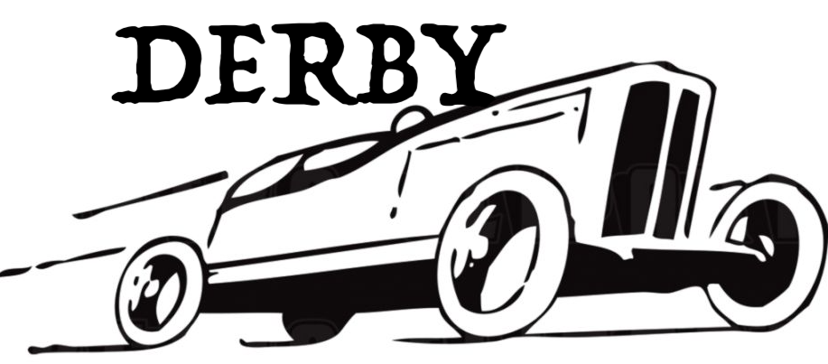

[Solomode](./announcement-solomode.md) invites you to play solo modes!  The most important time to do this is Derby.  The most important thing for you to do is properly record yours plays.

## Derby
Wait.  What's Derby?

Derby is a drag race between solo modes.  Solo mode creators are building them.  Their race cars (solo modes, of course!) will be lined up and the gun fired January 1, 2022.  The race will ensue until the end of January when your your plays will be tallied and the winners decided!

## Line Up
Several [categories](./categories.md) will be filled with solo modes.  The line up will begin forming in December and finalize come the 17th.

## Participation
Much of the contest hinges on your participation.  Your recorded plays are the fuel on which the race cars run, so to speak.  The contest's creators need your support.

See the [Players' Guide](./players-guide.md) for more detail on what you need to do.

## Important Dates
* Line Up - **December 17, 2021**
* Derby - **January 2022**

Mark your calendars or subscribe to this thread.  Creators may invite you to play test early releases announced here.

## Sponsorship
[Sponsors can put up prizes](./sponsors-guide.md) for one or more categories in exchange for ads.
