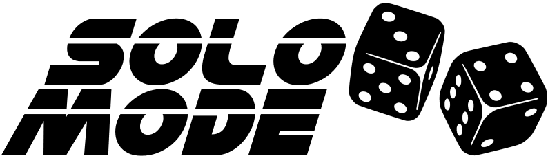

Solomode is back.

It's time for content creators to roll up their sleeves and get to creating solo modes for their beloved games.

If you've ever pondered "could I make a board game," participation in Solomode is a small step in that direction.  Last year's participants agreed.  [Creating a solo mode](./creators-guide.md) is an ideal first step for budding and hopeful game designers.  It dramatically shortens prototyping by providing you with most of the materials you need in a single box!

## Important Events
* Registration - **December 1 - December 14, 2021**
* Derby - **January 2022**

Hopefully this announcement whets your appetite for things to come and gives you [enough information](./creators-guide.md) to get started with the early stages of your design.

Wait.  What's Solomode?  Well, as the name implies, it's about solo modes—ones you create and enter into friendly competition.  These solo modes are revealed in a Line Up.  Solo mode enthusiasts will chosen and learn them.  You'll earn points in [the registered category](./categories.md) during [Derby](./announcement-derby.md) every time someone plays your solo mode.

Winners will be announced shortly after Derby concludes.

It's a coin with two sides:
* Solomode — the back-end contest for creators (see [Creators' Guide](./creators-guide.md))
* Derby — the front-end main event for players (see [Players' Guide](./players-guide.md))

Willing [sponsors can sponsor prizes](./sponsors-guide.md) for one or more categories in exchange for ads.
